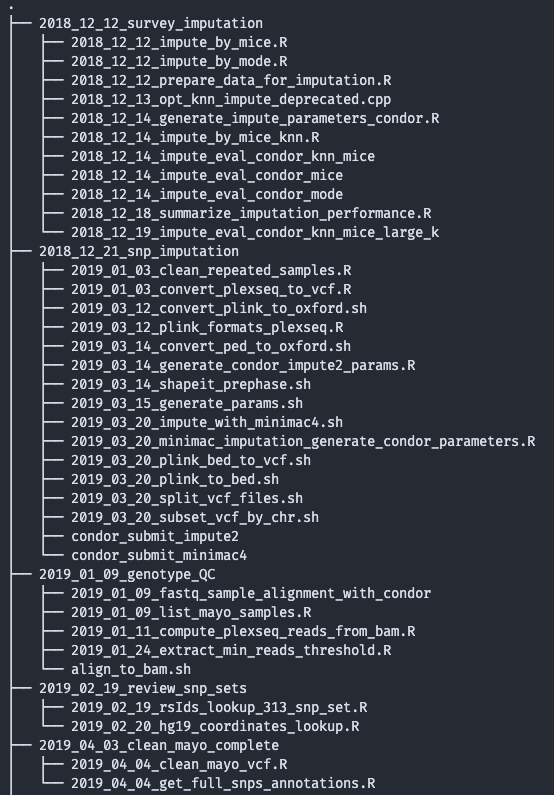
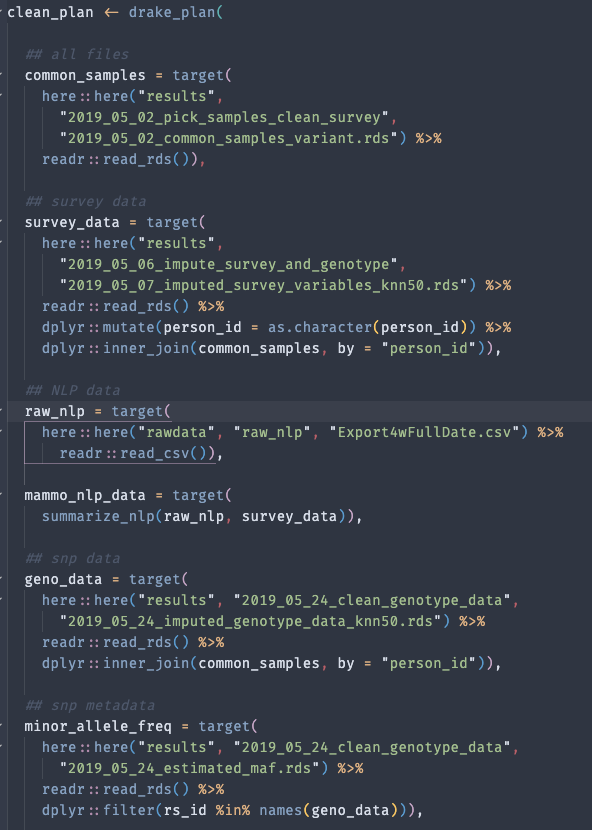
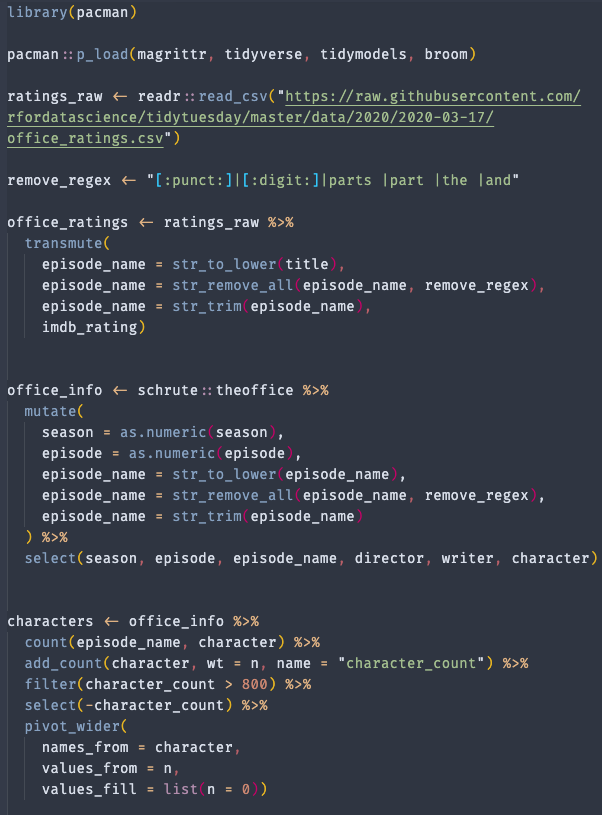
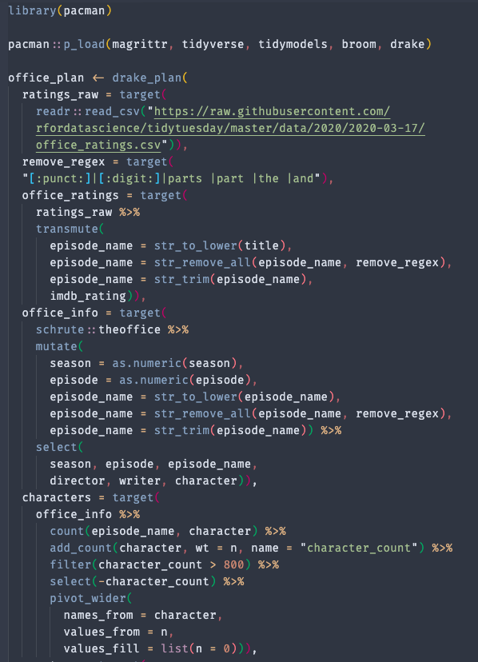

```{r xaringan-themer, include=FALSE}

library(pacman)
p_load(
  xaringanthemer,
  icon)

style_duo_accent(
  primary_color = "#035AA6",        # blue
  secondary_color = "#03A696",      # sea green
  header_font_google = google_font("Amatic SC"),
  text_font_google = google_font("Crete Round"),
  header_h1_font_size = "3.5rem",
  header_h2_font_size = "2.75rem"
)


```

```{r setup, echo = FALSE, messages = FALSE, warnings = FALSE, include = FALSE}

p_load(
  magrittr,
  tidyverse,
  drake)

knitr::opts_chunk$set( include = TRUE, eval = TRUE, cache = FALSE,
  echo = TRUE, autodep = TRUE, fig.align = "center",
  message = FALSE, warning = FALSE, fig.ext = "png")

```


class: center, top

# why drake?

```{r img, echo = FALSE}

knitr::include_graphics("https://rstudio-education.github.io/tidyverse-cookbook/images/data-science-workflow.png",)

```

???

.left.large[
- We repeat this process many times
- If one step is changed, we need to repeat all the process
- When there is a new dataset, we need to repeat the analysis
]

---
class: center, middle

# what is drake?

.larger[
**R package** that manages code dependencies, and allows for the analysis process to be **reproducible**

it was inspired by **make**

but it is completely `r fa_r_project(colour = "#035AA6")` centric
]

---
class: center, middle

# how to use drake?


---
class: center, middle

## how to use drake?

.pull-left[

#### scripts

```{r how1, echo = FALSE, out.width = "80%"}



```
]

.pull-right[

#### functions

```{r how2, echo = FALSE, out.width = "80%"}



```

]

???

- we change from scripts doing tasks to functions
- drake recognizes the elements in the plan automatically, and builds the process network
- detects the parts that have been 


---
class: left, middle

.center[
## drake details 🔽
]

.larger[The plan from is coded as a `tibble`, and `drake` detects the dependencies among targets]

```{r plan, echo = FALSE}

clean_plan <- drake_plan(

  ## all files
  common_samples = target(
    here::here("results",
      "2019_05_02_pick_samples_clean_survey",
      "2019_05_02_common_samples_variant.rds") %>%
    readr::read_rds()),

  ## survey data
  survey_data = target(
    here::here("results",
      "2019_05_06_impute_survey_and_genotype",
      "2019_05_07_imputed_survey_variables_knn50.rds") %>%
    readr::read_rds() %>%
    dplyr::mutate(person_id = as.character(person_id)) %>%
    dplyr::inner_join(common_samples, by = "person_id")),

  ## NLP data
  raw_nlp = target(
    here::here("rawdata", "raw_nlp", "Export4wFullDate.csv") %>%
      readr::read_csv()),

  mammo_nlp_data = target(
    summarize_nlp(raw_nlp, survey_data)),

  ## snp data
  geno_data = target(
    here::here("results", "2019_05_24_clean_genotype_data",
      "2019_05_24_imputed_genotype_data_knn50.rds") %>%
    readr::read_rds() %>%
    dplyr::inner_join(common_samples, by = "person_id")),

  ## snp metadata
  minor_allele_freq = target(
    here::here("results", "2019_05_24_clean_genotype_data",
      "2019_05_24_estimated_maf.rds") %>%
    readr::read_rds() %>%
    dplyr::filter(rs_id %in% names(geno_data))),

  snps = target(
    here::here("results", "2019_04_12_clean_snps",
      "2019_04_25_snp_data_unified.rds") %>%
    readr::read_rds() %>%
    dplyr::select(
      -hg19_base,
      -tidyselect::starts_with("rsnps"),
      -tidyselect::starts_with("haplo")) %>%
    dplyr::filter(rs_id %in% names(geno_data))),

  csv_files = target(
    readr::write_csv(!!rlang::sym(data),
      file.path("data", "csv",
        stringr::str_c("WWHS_", str_remove(data, "_data"),
        ".csv"))),
    transform = map(data = c("survey_data", "geno_data",
      "mammo_nlp_data")))
)

clean_plan

```

---
class: center, top

## drake dependency graph 🔽

```{r drake-graph, echo = FALSE, out.width = "100%", out.height="50%"}

knitr::include_app("extra/wwhs_plan_viz.html",
  height = "420px")

```

---
class: left, top

.center[
## drake's primary functions
]

.large[

Using `drake_plan` and `target`, we build the plan:

```{r demo-plan, echo = TRUE, eval = FALSE}

my_plan <- drake_plan(
  cmd1 = target(file_in),
  cmd2 = fun(cmd1),
  report = render(knitr_in("knitr_file")))

```

* Using `file_in`, `file_out` and `knitr_in` we specificy the objects that are saved explicitly to disk

```{r demo-plan2, echo = TRUE, eval = FALSE}

make(my_plan)  ## all plan
make(my_plan, targets = "cmd1") ## only `cmd1`

```

* To generate the graph dependency `widget`

```{r vis-plan, echo = TRUE, eval = FALSE}

viz <- vis_drake_graph(my_plan)
htmlwidgets::saveWidget(viz, file = "file.html")

```

]

---
class: top, center

# Lasso fit example

## Obtained and edited from [Julia Silge's blog](https://juliasilge.com/blog/lasso-the-office/)

```{r js-blog, echo = FALSE, out.width = "80%"}

knitr::include_url("https://juliasilge.com/blog/lasso-the-office/",
  height = "300px")

```


???
take home message: use functions instead of scripting

- this makes stuff re-usable beyond copy and pasting chunks of code
- we don't need to keep editing multiple copies of the same plot
- goal: predict imdb score from `the office data`

---
class: center, middle

## The office example (demo time)

.larger[The code is almost the same]

.pull-left[

```{r office-example, echo = FALSE, out.width = "80%"}



```
]

.pull-right[

```{r office-example2, echo = FALSE, out.width = "80%"}



```

]

??? 
The idea is to show here that if we source the code:
- the main code will run everything as many time as needed but all
- drake only runs what is necessary

---
class: left, top

.center[
## The office example]

```{r office-depens, echo = FALSE, out.width = "100%", out.height="50%"}

knitr::include_app("extra/office_plan.html",
  height = "420px")

```

???
We can access all targets from `office_plan` in the knitr slides

---
class: left, top

.center[
## Extra]

.larger[Now, since `office_plan` was ran as part of the slides project, we can access elements from the plan]

```{r office-data}

readd(office)

```

---
class: left, top

.center[
## Manipulate-plots]

.larger[We can access elements from `office_plan`]

```{r office-bp, include = TRUE, echo = TRUE, eval = TRUE, fig.width = 8, fig.height = 3, out.width = 900, dpi = 800, fig.showtext = TRUE}

readd(office_boxplot)

```

---
class: left, top

.center[
## Manipulate-plots]

.larger[and even modify it]

```{r office-bp2, include = TRUE, echo = TRUE, eval = TRUE, fig.width = 8, fig.height = 3, out.width = 900, dpi = 800, fig.showtext = TRUE}

readd(office_boxplot) + theme_xaringan() +
  scale_xaringan_fill_discrete()

```

---
class: left, top

```{r office-err, include = TRUE, echo = TRUE, eval = TRUE, fig.width = 8, fig.height = 5, out.width = 900, dpi = 800, fig.showtext = TRUE}

loadd(error_plot)
error_plot + theme_xaringan() + scale_xaringan_colour_discrete()

```

---
class: left, middle

.center[
# drake advantages
]

.larger[
1. Everything is reproducible, and easy to generalize
2. It is not necessary to remember the locations of previously generated files, as everything is accessed by doing `readd(target)` or `loadd(target)`
3. We can even configure the `cache` in the `rmd` file, so we only re-reprocess report segments that depend on a specific analysis
4. I showed a simple example, but is possible to make more complex plans wih `cross`, `map`, etc
5. Can do larger plans with `bind_plans`
6. Allow for less replication, i.e. only have 1 table / 1 plot, and modify it in the report / slides.

]

---
class: left, top

.center[
# drake problems (for us)
]

.larger[
1. `drake` is not compatible with condor. In the documentation is mentioned that it can work with `slurm` though
2. Everything is saved in a `invisible cache` folder, so it can get very big with our kind of datasets, e.g. 200MB large `Seurat` objects 
3. Since the package is `R`-centric, I am not sure if it is possible to allow for non-R tools (I know that there is a package called [processx](https://processx.r-lib.org/) to run stuff from the command line within `R`,  but haven't experimented with it)
4. `drake`'s parallelization doesn't handle [BiocParallel](https://bioconductor.org/packages/release/bioc/html/BiocParallel.html) multiple handlers. This is concerning, because we use a lot of `bioconductor` packages that use that engine for parallel processing, e.g. `DESeq2`, `edgeR`, `zinb-wave`, etc.
]

---
class: center, middle

.center[
# Resources
]

### [drake's manual](https://books.ropensci.org/drake/)
### [drake's github page `r fa_github()`](https://github.com/ropensci/drake/issues)
### [`r fa_r_project()` opensci communty](https://discuss.ropensci.org/)

.superlarger[
# Thank you very much!
]