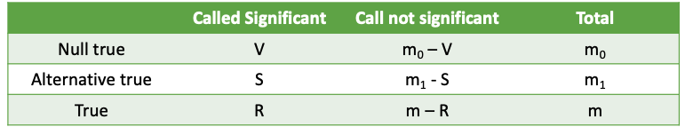
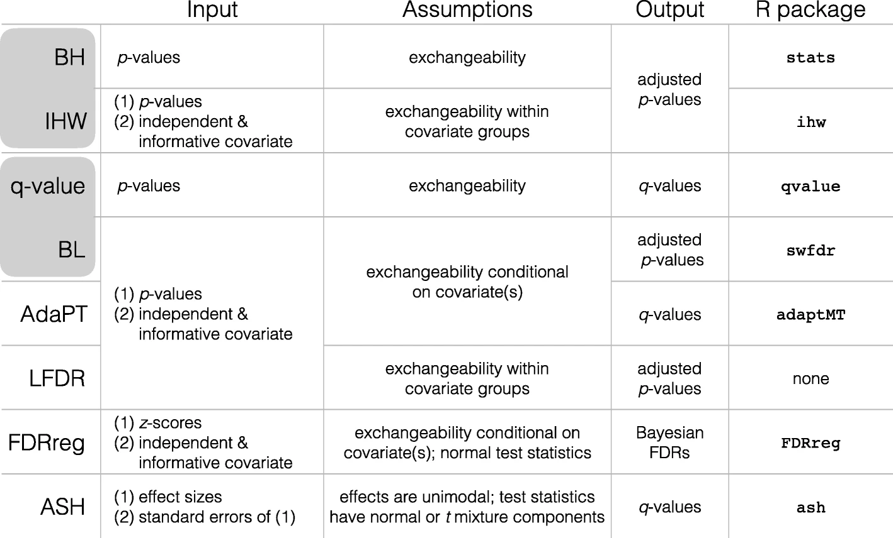
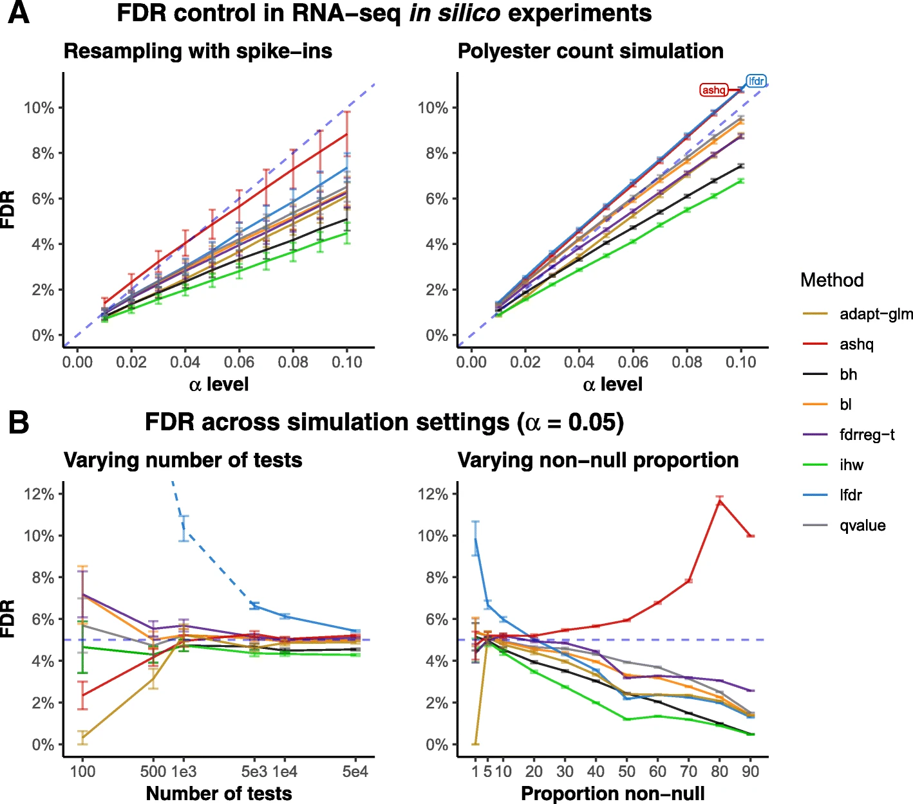
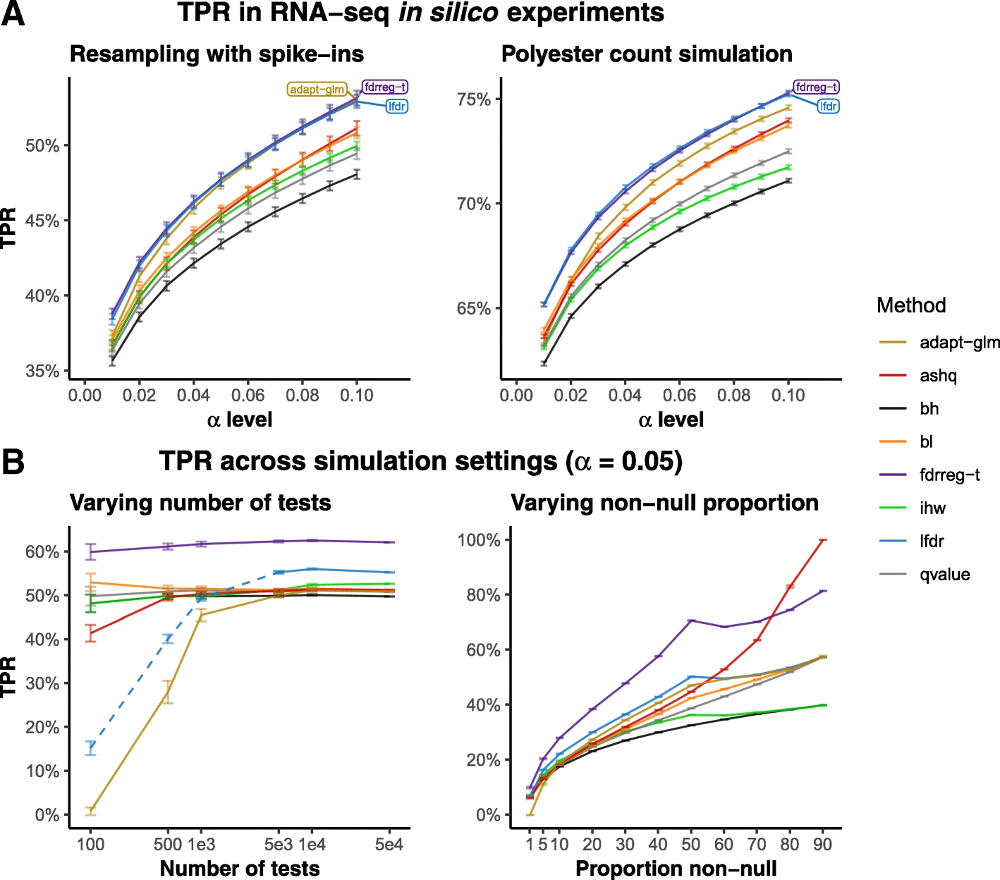
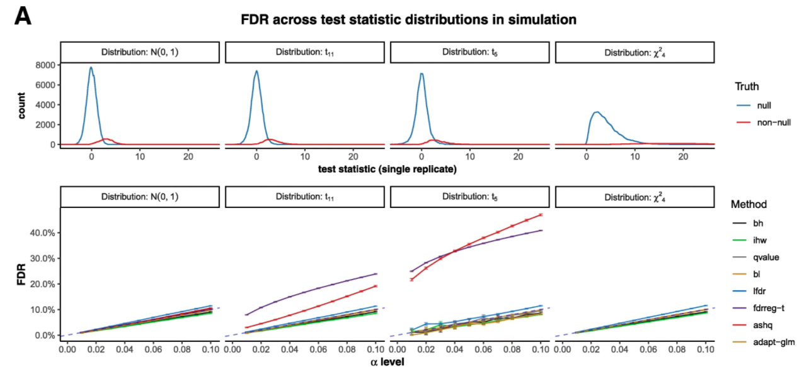
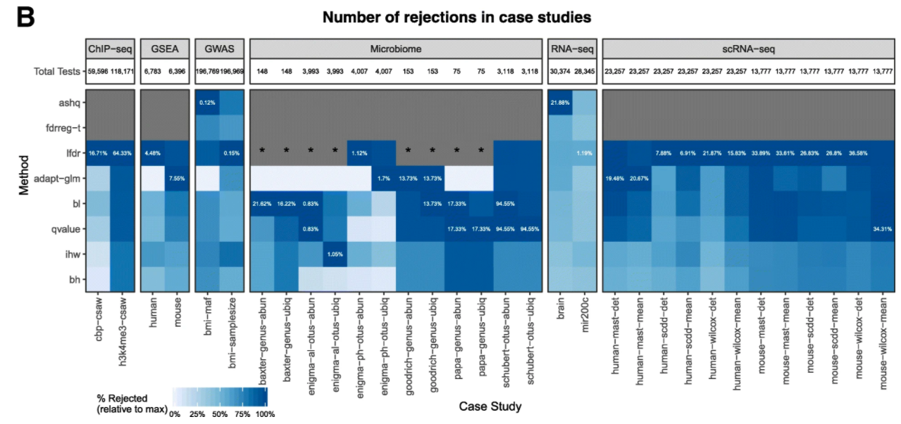
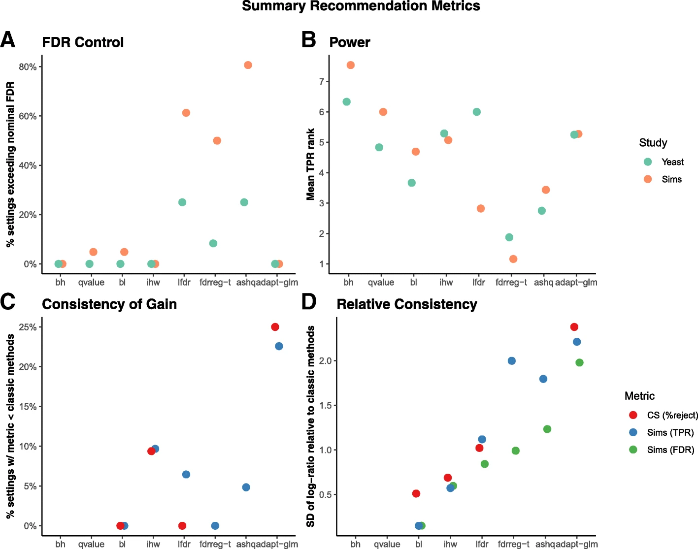
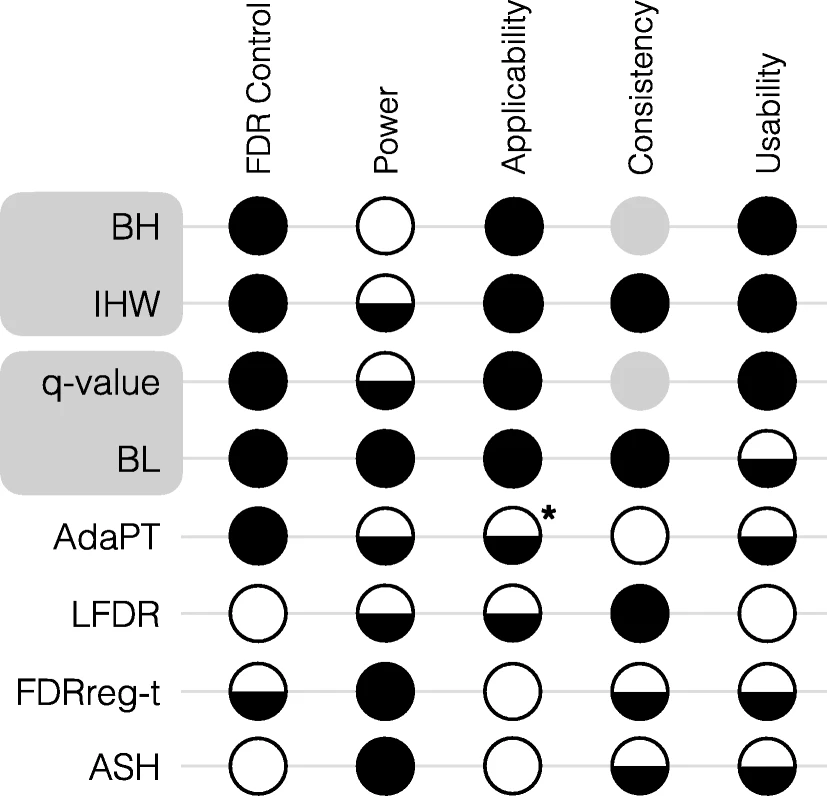

class: center, middle, bg-main1

# slides: https://bit.ly/3bz1Y4N

## .red[But today] is Mexico's .green[independence day so...]

```{r gitf,echo=FALSE,out.width="50%"}

knitr::include_graphics("https://media.giphy.com/media/AwcmOV28QPnck/giphy.gif")

```


---
class: center, middle

# .alert[[Why this paper?](https://genomebiology.biomedcentral.com/articles/10.1186/s13059-019-1716-1)]

## In statistics, we usually estimate our parameters and then we want to do some inference over the estimates

## We usually compute a p.value for each parameter, and if p.value $\leq$ a threshold p, then we say that there is some significant / confidence of the estimate being true

## The question that we are trying to answer is what happens when we are estimating a really large number of parameters?

## .blue[This paper was conceived a journal club about the FDR]

## .blue[This paper illustrates how a statistical concept is applied to a different settings]

---
class: center, middle

# .alert[Hypothesis testing]

## We have a model with parameters $\theta \in \Theta$

## we test $\mathcal{H}_0: \theta = \theta_0$ vs. $\mathcal{H}_1: \theta \neq \theta_0$, we can make two errors

```{r ht, echo = FALSE, out.width = "70%"}

knitr::include_graphics("images/hypothesistable.png", dpi = 300)

```

## Want to minimize $\alpha$ while controlling $\beta$

---
class: center, middle

# .alert[What is a p.value?]

## The p.value is a way of quantifying the strength of the evidence against the null hypothesis vs the alternative

## .alert[Official definition] The p.value is the **conditional probability** of observing data at least favorable to the .alert[alternative] $\mathcal{H}_1$ given the .alert[null] $\mathcal{H}_0$


```{r pvalue, echo = FALSE, out.width = "40%"}

knitr::include_graphics("images/pvalue.png", dpi = 300)

```

Observe $X_1,\cdots,X_n \sim \mathcal{N}(\mu,\sigma^2)$ and test $\mathcal{H}_0: \mu = \mu_0$ vs $\mathcal{H}_1: \mu < \mu_0$. [(the material is from this notes)](https://xiangzhu.github.io/stanford-stats110/hypothesis_test)

---
class: center, middle, bg-main1

# .red[Multiple] hypothesis .green[testing]

---
class: left, middle

# .center.alert[Multiple hypothesis testing]

## - .alert[RNA-seq:] differential expression
## - .alert[ChIP-seq:] differential binding
## - .alert[GSEA:] DE genes representative in pathway
## - .alert[GWAS:] SNPs associated with a trait
## - .alert[Microbiome:] Differential abundance

```{r mht, echo = FALSE, out.width = "70%", fig.align = "center"}



```

### The table above resembles the original for single hypothesis, but counting the cases: $V$ are the false positives, $m_1 - S$ are the false negatives, ... 

---
class: left, middle

```{r pvals-sim , include = TRUE, echo = FALSE, eval = TRUE, cache = TRUE}

pacman::p_load(magrittr, tidyverse, scales)

theme_set(theme_bw())

m <- 10000
set.seed(20141215)
# generate hypotheses
pvals <- tibble(
  anticonservative = c(replicate(m * .3, t.test(rnorm(10, .6))$p.value),
    runif(m * .7)))
# just for anticonservative
oracle <- relevel(factor(rep(c("Alternative", "Null"), c(m * .3, m * .7))),
  "Null")
oracle %<>% fct_relevel("Alternative")
pvals$null <-  runif(m)
pvals$bimodal <- replicate(m, t.test(rnorm(10, rnorm(1, .2, .5)),
  alternative = "greater")$p.value)
pvals$conservative <- 1 - pvals$anticonservative
pvals$sparse <- replicate(m, wilcox.test(rnorm(4), rnorm(4, 1))$p.value)
pvals$weird <- c(runif(m * .5), rbeta(m * .4, 2, 2), rep(1, m * .1))

```

# .center.alert[Why MHT corrections?]

### When doing multiple testing, we get pvalues $p_1,\cdots, p_m$, which are supposed to look as:

```{r pvals, include = TRUE, echo = FALSE, eval = TRUE, fig.width = 8, fig.height = 4, out.width = "60%", fig.align = "center", cache = TRUE, dependson = "pvals-sim"}

pvals %>%
  ggplot(aes(anticonservative, fill = oracle)) +
  geom_histogram(binwidth = 0.025, colour = "black", boundary = 0) +
   labs(fill = "Truth", x = "p.values") +
  theme(legend.position = "top",
    legend.title = element_text(size = 18),
    legend.text = element_text(size = 14),
    strip.text = element_text(size = 18),
    axis.text = element_text(size = 14),
    axis.title = element_text(size = 18)) +
scale_color_manual(values = "black") +
  scale_fill_manual(values = c("Alternative" = "white", "Null" = "lightblue"))
  
```

### - It could be expected that some tests are being called significant by chance.

### - Classical methods to control this: FWER, $\mathbb{P}(V \geq 1)$, etc. These methods are highly conservative, i.e. we get very few discoveries

---
class: left, middle

# .center[Some definitions]

# $\text{FWER} = \alpha / m$

# $\text{FDR} = \mathbb{E} \left[\frac{V}{R} | R > 0\right]$

# .center[Benjamini Hochberg]

.left[
## - Sort p.values $p_{(1)},\cdots, p_{(m)}$,
## - Compute $L = \max \{j : p_{(j)} < \alpha j / m \}$
## - Reject hypothesis $p_j \leq p_{(L)}$
]


---
class: center, middle, bg-main1


# .red[Finally] the .green[paper !]


---
class: center, middle

# .alert[What this paper is about?]

## The authors compare in real and simulated data the following methods

```{r methods, include = TRUE, echo = FALSE, eval = TRUE, out.width = "75%"}



```

---
class: left, middle

# .alert.center[More details]

### .red[Note:] For this paper, the authors gathered different methods to control the .teal[FDR] and then applied to simulated and real data. In the manuscript, the authors report the finding of their journal club

### .blue[exchangeability:] this means that $(X_1,\cdots, X_n)$ and $(X_{\sigma(1)},\cdots, X_{\sigma(n)})$ have the same distribution for any permutation $\sigma$

### .teal[BH] and .teal[q-value] are the earliest methods. In fact, under certain conditions both are equivalent

### A common theme is to use external information, for example .teal[IHW], requires a covariate independent of the p.values or .teal[ASH], which is based in GWAS / eQTL experiments and requires effect sizes and std. errors

### [The authors provide a website with more analysis](https://www.pkimes.com/benchmark-fdr-html/) which is a great reference to start analysis

---
class: left, middle

# .alert.center[FDR control in silicon experiments and simulations]

```{r fig2, out.width = "65%", fig.align = "center", echo = FALSE}



```

???

.left.large[
- Modern methods don't control the FDR always
- Randomly selecting 2 sets of 5 - 10 samples from a dataset of 48 biological replicates and adding differential signal to genes to define TP
- lfdr and fdrreg-t do not control FDR with few tests
- lfdr and ashq don't control FDR for extreme proportions
- panel a: want to be close or below the diagonal
- panel b: want to be at line or below
]

---
class: left, middle

# .alert.center[Power in silico experiments and simulations]

```{r fig3, out.width = "65%", fig.align = "center", echo = FALSE}



```

???

.left.large[

- Modern methods are modestly more powerful. 
- Power of modern methods is sensitive to how informative is the covariate. Including a non-informative covariate is not harmful
- panel a: Want to have higher tpr as we increase the $\alpha$
- panel b:
  - left: best case scenario: want the curves to be flat. Same rate of discovery as we increase the number of tests
  - right: as the proportion of non-null increases, want to get more discoveries

]

---
class: left, middle

# .alert.center[Applicability of benchmarked methods to various test statistics I]

```{r fig4a, out.width = "100%", fig.align = "center", echo = FALSE}



```

???

.left.large[

- Top: 4
  - 4 different simulation settings
  - The simulation is based on the fact that if $X \sim F$ then $F(X) \sim \text{U}(0,1)$, this means that conditional under the null the p.value ~ Unif too
  
- Bottom 4: ashq and fdrreg-t fail on the t simulations, because they are only approximating but there is not complete method

]

---
class: left, middle

# .alert.center[Applicability of benchmarked methods to various test statistics II]

```{r fig4b, out.width = "100%", fig.align = "center", echo = FALSE}



```

???

.left.large[

### Independent covariates utilized

- Microbiome: prevalence, non-zero mean
- GWAS: minor allele frequency, sample size (for meta-analysis)
- GSEA: gene set sizes
- Bulk RNA-seq: average gene expression
- single cell RNA-seq: average non-zero gene expression, detection rate: # samples were the gene expression is > 0
- ChIP-seq: average read depth for the region / length of the region

]


---
class: left, middle

# .alert.center[Summary metrics (left) and recomendations (right)]

```{r fig5-6, out.width = "50%", echo = FALSE}




```

### .right[BL software was recently updated to fix that middle point]

???

Top:
yeast - simulated spike ins
sims - 4a

a - adapt-glm, ihw, bl archiever FDR control in almost all sim and in silico experiments
b - on average ranked near the mean in terms of TPR
  - superior: mean rank tpr < 5
  - satisfactory: mean rank tpr < 6
  - else unsatisfactory

c - d: relative comparisons respect to BH / qvalue

right panel:

full - good
empty - bad


---
class: left, middle

# .center.red[Bibliography: Books]

## - Book about stats for modern bio http://web.stanford.edu/class/bios221/book/

## - Focused on genomics http://genomicsclass.github.io/book/

## - Basic stats https://xiangzhu.github.io/stanford-stats110/index.html

# .center.green[Bibliography: papers]

## - [BH](https://www.stat.purdue.edu/~doerge/BIOINFORM.D/FALL06/Benjamini%20and%20Y%20FDR.pdf), [qvalue](https://projecteuclid.org/euclid.aos/1074290335), [math justification of FDR](https://projecteuclid.org/euclid.aos/1085408494)

## - With covariates [IHW](nature.com/articles/nmeth.3885), [BL](https://doi.org/10.1101/035675) (the software was recently improved too!)
## - signed FDR [ASH](https://academic.oup.com/biostatistics/article/18/2/275/2557030), [MASH](https://www.nature.com/articles/s41588-018-0268-8), etc
## - Not here but locally made 🐄 [MHT under dependent models](https://projecteuclid.org/euclid.aoas/1475069624)

---
class: left, middle

# .center.blue[Extra: Diagnostics]

## Want a peak at 0, and uniform otherwise need to review the data. [More details in this blog post](http://varianceexplained.org/statistics/interpreting-pvalue-histogram/)

```{r pvals-all, include = TRUE, echo = FALSE, eval = TRUE, fig.width = 15, fig.height = 7.5, out.width = "90%", fig.align = "center", cache = TRUE, dependson = "pvals-sim"}

pvals %>%
  mutate(id = row_number()) %>%
  pivot_longer(-id, names_to = "variable", values_to = "value") %>%
  # mutate(
  #   variable = fct_relevel(
  #     factor(variable), "anticonservative", "uniform",
  #     "bimodal", "conservative", "sparse", "weird")) %>%
  ggplot(aes(value)) +
    geom_histogram(binwidth = 0.025, colour = "black",
      fill = "white", boundary = 0) +
   labs(fill = "Truth", x = "p.values") +
   facet_wrap( ~ variable) +
   theme(strip.background = element_blank(),
    strip.text = element_text(size = 18),
    axis.text = element_text(size = 14),
    axis.title = element_text(size = 18))

```

---
class: center, middle, bg-main1

.font5[.red[Muchas] gracias por su .green[atencion!!]]

.font5[and]

```{r gif2,echo=FALSE,out.width="50%"}

knitr::include_graphics("https://media.giphy.com/media/VMAg1fTuO7yW4/giphy.gif")

```