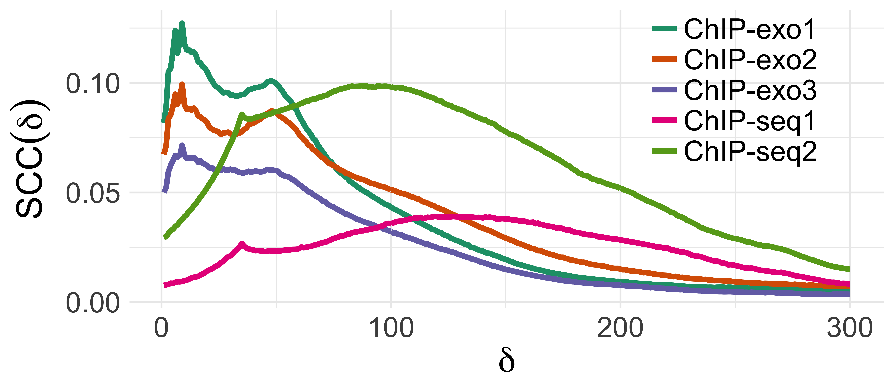

class: top
```{r opt,include=FALSE,echo=FALSE,eval=TRUE}

library(knitr)
opts_chunk$set(echo = FALSE,include= TRUE)
```


## Rene Welch

.left-column2[
```{r logo,include=TRUE,dpi = 300,out.width="250px"}
include_graphics("figs/color-center-UWlogo-print.png")
```
]

.right-column2[

### PhD candidate in Statistics

- Projects:

    - ChIPexoQual: A quality control pipeline for ChIP-exo/nexus data
    
    - Fine-mapping method for SNPs in High LD, associated to multiple responses
    
    - Biological effects of EBV
    
- Analysis experience:

    - ChIP-seq/exo/nexus, DNAse/ATAC-seq, RNA-seq, MeDIP-seq, MPRA, GWAS
    
]

---
class: center, middle, inverse

# ChIPexoQual: A quality control pipeline for ChIP-exo/nexus data

---
class: center, middle

# ChIP-exo vs ChIP-seq

```{r chipseq_exo,dpi =1500,out.width="600px",fig.cap="Coverage of different ChIP-protocols, Pugh & Rhee 2012"}

```

---
class: top

# ChIP-exo/nexus protocols

.pull-left[
```{r protocols,dpi = 1500,out.width = "400px"}

```
]

.pull-right[

After DNA sonication:

- In ChIP-exo a $\lambda$-enzyme digests from the $5\prime$ end until it finds the TF, then one adapter is added for each side

- In ChIP-nexus, only one adapter is added at the $3\prime$ end, transferred to the $5\prime$ end by self-circularization. Unique fragments are distinguished by using random barcodes.

- In SE (PE) ChIP-seq, one (two) adaptors are added.
]

---
layout: true

background-image: url(figs/kmer_profiles.png)
background-size: 600px

---
class: top, center 

## FASTQC

---
class: top, center 

## FASTQC

.pull-right[
```{r, dpi = 500,out.width="300px"}
include_graphics("figs/motif.png")
```
]

---
layout: false
class: top

.pull-left[

## PBC

\begin{aligned}
\mbox{PBC} = {\text{# of locs. with exactly 1 read}\over\text{# of locs. with }\geq 1\text{ reads}}
\end{aligned}


```{r pbc, out.width="400px"}


```

.important[ENCODE] bottlenecking thresholds:

- .important[0.9 - 1] None

- .important[0.8 -0.9 ] Mild

- .important[0.5 -0.8 ] Moderate

- .important[0 -0.5 ] Severe

]

--

.pull-right[

## SCC
\begin{aligned}
\mbox{SCC}(\delta) = \sum_c w_c \rho(\mbox{fwd}_c - \delta , \mbox{bwd}_c + \delta)
\end{aligned}

```{r scc, out.width="600px",dpi = 1000}



```

\begin{aligned}
\mbox{NSC} &= {\max_\delta \mbox{SCC}(\delta) \over \min_\delta \mbox{SCC}(\delta)  }, \\
\mbox{RSC} &= {\max_\delta \mbox{SCC}(\delta) - C \over \min_\delta \mbox{SCC}(\delta) - C  }
\end{aligned}

]


--
These metrics are available in [ChIPUtils](http://www.github.com/welch16/ChIPUtils)

---
class: top

# ChIPexoQual pipeline

Assuming a set of .important[N aligned reads]

1. Partition the genome and generate ChIP-exo islands

```{r diag, dpi=700,out.width="900px"}

```

---
class: top
# ChIPexoQual pipeline 
Assuming a set of .important[N aligned reads]

1. Partition the genome and generate ChIP-exo islands

2. Calculate summary statistics for each islands

\begin{aligned}
D_i &= \text{# of aligned reads in island } i \\
U_i &= \text{# of unique positions that reads map in islands } i \\
W_i &= \text{width of islands } i \\
\mbox{ARC}_i &= D_i / W_i (\text{ represents sample enrichment}) \\
\mbox{URC}_i &= U_i / D_i (\text{ represents library complexity}) 
\end{aligned}

---
class: top
# ChIPexoQual pipeline 
Assuming a set of .important[N aligned reads]

1. Partition the genome and generate ChIP-exo islands

2. Calculate summary statistics for each islands

3. Visualize all islands together

```{r qc_viz,dpi = 800,out.width="700px",fig.align="center"}


```

---
class: top
# ChIPexoQual pipeline 
Assuming a set of .important[N aligned reads]

1. Partition the genome and generate ChIP-exo islands

2. Calculate summary statistics for each islands

3. Visualize all islands together

4. Calculate quality scores for the .important[ARC vs URC] plot:

\begin{aligned}
  D_i &= \beta_1 U_i + \beta_2 W_i + \varepsilon_i ,\quad \varepsilon_i \sim N(0,\sigma^2) 
\end{aligned}
--
5. If necessary, use extra modules: 

      1. Subsampling approach for deeply sequenced samples
      
      2. Analysis of blacklisted regions
      
      3. Strand-imbalance analysis

--
Available at [Bioconductor](http://www.bioconductor.org/packages/release/bioc/html/ChIPexoQual.html)

---
class: top, center

# ARC vs URC plot

.left-column2[

Two arms: One with a decreasing trend and other with low .important[ARC] 

- As .important[URC] decreases, the number of unique positions per region decreases

- The regions with low .important[ARC], are sort of like ChIP-exo's "background"


]


.right-column2[
```{r,include=TRUE,out.width="250px"}

```

```{r,include=TRUE,out.width="380px"}

```
]


---
class: top, left

## Quality scores

We sample 1K regions, and fit the linear model:

\begin{aligned}
  D_i &= \beta_1 U_i + \beta_2 W_i + \varepsilon_i ,\quad \varepsilon_i \sim N(0,\sigma^2) ,
\end{aligned}
at least 1K times.

```{r scores,include=TRUE,dpi = 1000,out.width="900px"}
include_graphics("./figs/quality_scores.png")
```

---
class: top

## TBP ChIP-exo vs. ChIP-nexus at fixed sequencing depth

```{r scores2,include=TRUE,dpi = 1000,out.width="900px"}


```

- ChIP-nexus is better than ChIP-exo


---
class: inverse, middle, center

# Fine-mapping of SNPs in High LD associated to multiple eQTLs

---
class: top, left

# Motivation: Fine-mapping of SNPs in High LD

.right-column[
```{r , dpi = 700,out.width="500px"}

```
]

--

.left-column[
- SNPs are in very high LD

- Peak overlaps don't separate them either.

- .important[Our solution:] Add allele-specific information
]

---
class: top, left

## Measuring allele-specific activity

1. Mask SNP positions in human genome

2. Align FASTQ files to masked genome with `bowtie2`, and separate the alignment to each allele with [SNPsplit](https://www.bioinformatics.babraham.ac.uk/projects/SNPsplit/)

3. For every SNP:

      a. Count reads aligned to each allele
      
      b. For reads aligned to both alleles, solve the tie by randomly allocating them with prob. 0.5
      
4. Calculate TF skew as:
$$
\mbox{skew} = \log_2( 1 + \mbox{alt}) - \log_2( 1 + \mbox{ref})
$$
5. Aggregate the reads to avoid "artificial" allele-specific balance:

$$
\mbox{skew}_{\text{alle}}  = \log_2\left(1 + \sum_a \mbox{alt}_a 1(\mbox{alt}_a \geq \mbox{ref}_a) \right) - \log_2\left(  1 + \sum_a \mbox{ref}_a 1(\mbox{alt}_a < \mbox{ref}_a)\right)
$$

---
class: top, left

## Description of the model

.pull-left[

```{r eqtl,out.width="500px",dpi = 800}


```
\begin{aligned}
w_{gk} &\sim \mbox{Ber}(\pi) \\
\widetilde{y}_{gk} \vert w_{gk} =0, \widetilde{x}_{gk} &\sim N(0,\sigma^2_{b}) \\
\widetilde{y}_{gk} \vert w_{gk} = 1,\widetilde{x}_{gk} &\sim N( \widetilde{x}_{gk}\beta, \sigma^2_{gk})
\end{aligned}

]

--

.pull-right[

Using a set of .important[regulatory] SNPs

1. Cluster SNPs by corr. and distance

2. Given a set of causal candidates, iterate:

      i. Calculate prob. of LD block of containing a causal SNP
      
      ii. Fit weighted LMM:
      
      $\widetilde{y}_{gk} = \widetilde{x}_{gk} \beta + \widetilde{z}_{gk} u_g + \widetilde{\epsilon}_{gk}$
        
      iii. Select another set of causal candidates 

]

---
class: top, left

## Performance

.pull-left[
```{r roc,dpi = 1000,out.width="300px"}


```


]

.pull-right[
```{r aupr,dpi = 1000,out.width="300px"}


```

]

---
class: middle, center

```{r desc,out.width="700px",dpi = 1000}

```


---
class: inverse, middle, center

# Acknowledgements

## Keles lab 

## Johannsen lab


